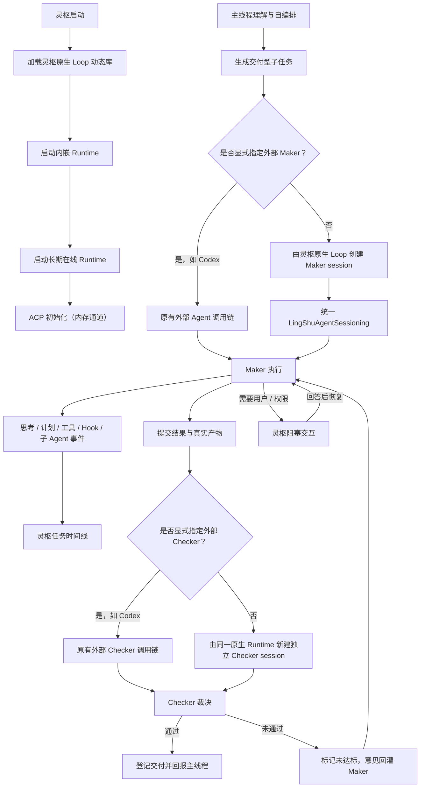

# 内嵌默认 Loop Runtime

灵枢是 Runtime Host，定位类似 Agent 世界里的 JVM。Grok 派生源码已经成为灵枢原生 Loop 的内置实现：它被编入灵枢、随 App 启动并在同一进程常驻，不作为外部 CLI 调用，也不再作为一个需要用户选择的“兼容引擎”暴露。配置中的“灵枢原生 Loop”同时控制默认内部 Maker 和默认内部 Checker；旧原生执行器只保留为 Runtime 不可用时的隐藏应急兜底。

边界保持不变：主线程、任务拆分、并发闸门、任务账本、产物探测、Maker/Checker 角色分离和最终回报都属于灵枢。Runtime 内部的 Strategist、Verifier 与子 Agent 只是该 session 的内部实现，不取代灵枢外层的 Maker/Checker 协议。

路由优先级只有一条：**显式外部 Agent 绑定 > 灵枢原生 Loop**。因此可以组合使用“Codex Maker + 原生 Checker”、“原生 Maker + Codex Checker”或“Codex Maker + Claude Checker”；最后一种情况完全不经过默认 Loop。Maker 和 Checker 即使使用同一 Runtime，也必须是两条隔离 session。

模型配置不写死模型列表。Runtime 启动时读取灵枢当前已选择的 provider、endpoint、协议、模型和本地凭据，并把所有辅助模型槽位绑定到该活动模型。因此 OpenAI、Anthropic、Kimi、DeepSeek、MiniMax、本地或兼容端点走同一个内嵌执行器，也不要求 xAI 账户授权。
