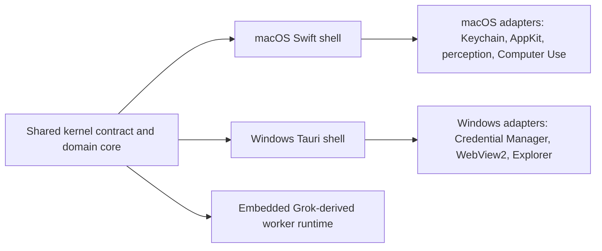

# LingShu for Windows

LingShu's Windows shell is a Tauri 2 desktop application backed by the shared Rust runtime in [`Runtime/LingShuCore`](../Runtime/LingShuCore). It is intentionally not a fork of the agent logic. The macOS embedded worker runtime and the Windows shell both compile against the same versioned kernel contract in [`kernel-contract.json`](../Runtime/LingShuCore/resources/kernel-contract.json).

## Architecture



The frozen ABI includes the core session loop, tool ABI, plugin runner, sensory-source interface, and plugin permission manifest. Swift tests compare every frozen symbol with the JSON contract. The embedded runtime validates the same contract when it loads, and the Windows build consumes it directly.

## Current Windows Scope

Implemented in the Windows technical preview:

- forced first-run language and model-channel setup;
- OpenAI-compatible and Anthropic-compatible providers, including built-in presets for OpenAI, Claude, DeepSeek, MiniMax, OpenRouter, Qwen, Doubao, Ollama, LM Studio, and custom endpoints;
- one serialized main-task queue with persistent conversation and task records;
- full-history GoalSpec generation without a fabricated default fallback;
- persistent model/tool sessions with streaming response and concise reasoning-summary events;
- isolated worker and checker sessions, including parallel child dispatch and parent-result return;
- structured execution events for model calls, plans, tools, delegation, human participation, and final results;
- exact-session pause and resume when a tool requires user input;
- failure and timeout cleanup that leaves no task or event falsely marked as running;
- registered local artifacts and built-in preview for text, Markdown, code, HTML, images, PDF, DOCX, and PPTX;
- explicit buttons to open a file in its Windows default application or reveal it in Explorer;
- API tokens stored in Windows Credential Manager;
- bilingual Chinese and English UI.

Deliberately unavailable in this preview:

- direct Windows UI control;
- live camera, microphone, and desktop perception;
- unattended external application automation.

Opening an artifact in a Windows application is always an explicit user click. The model cannot invoke that adapter.

## Download

- [Windows x64 setup executable](https://github.com/RoyZhao1991/LingShu/releases/download/windows-v0.1.0-preview.1/LingShu-Windows-x64-Setup.exe)
- [Windows preview release and MSI alternatives](https://github.com/RoyZhao1991/LingShu/releases/tag/windows-v0.1.0-preview.1)
- [SHA-256 checksums](https://github.com/RoyZhao1991/LingShu/releases/download/windows-v0.1.0-preview.1/SHA256SUMS.txt)
- [Signed and notarized macOS alpha](https://github.com/RoyZhao1991/LingShu/releases/download/v0.1.0-alpha.9/LingShu-0.1.0-12-macOS-universal.dmg)

## Build

Prerequisites: Windows 10/11, Node.js 22, the stable Rust MSVC toolchain, and the Tauri 2 Windows prerequisites.

```powershell
cd WindowsApp
npm ci
npm run tauri -- build
```

The build produces both an MSI and an NSIS setup executable under `WindowsApp/src-tauri/target/release/bundle`. The `Windows` GitHub Actions workflow performs the same build on a real Windows runner and uploads both installers plus SHA-256 checksums.

## 中文说明

Windows 版采用 Tauri 2 外壳，但任务状态、GoalSpec、模型协议、持久化、产物登记和预览等平台无关逻辑来自同一个 Rust 共享内核。macOS 与 Windows 通过同一份版本化 ABI 契约锁定边界，避免后续演进成两套互不兼容的产品。

当前技术预览已经覆盖首次启动引导、主脑配置、主对话、单主任务队列、隔离子线程并行、worker/checker、流式模型响应、推理摘要与工具事件、人机阻断续跑、线程记录、产物登记和应用内预览。Windows 的直接电脑操作、实时视觉和实时听觉暂不开放。点击“用系统应用打开”或“在文件夹中显示”属于明确的用户动作，模型不能自行触发。
