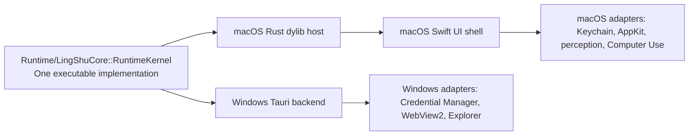

# LingShu for Windows

LingShu's Windows shell is a Tauri 2 desktop application backed by the canonical Rust runtime in [`Runtime/LingShuCore`](../Runtime/LingShuCore). It is intentionally not a fork or a reimplementation of the agent logic. Windows constructs `RuntimeKernel` directly in its Tauri backend; macOS loads a Rust dynamic-library host that constructs the same `RuntimeKernel` type. The versioned contract in [`kernel-contract.json`](../Runtime/LingShuCore/resources/kernel-contract.json) guards that shared implementation's platform boundary.

## Architecture



GoalSpec generation, the serialized main-task queue, isolated worker/checker sessions, model tool loops, human-action pause/resume, artifacts, persistence, and runtime events live only in `RuntimeKernel`. Swift and Tauri project that canonical state into native UI and provide platform adapters; they do not maintain duplicate agent loops. The frozen ABI covers the platform boundary, and tests verify both shells instantiate the same Rust implementation and produce equal core semantics for the same inputs.

## Current Windows Scope

Implemented in the Windows technical preview:

- forced first-run language and model-channel setup;
- OpenAI Responses, OpenAI-compatible Chat Completions, and Anthropic Messages providers, including built-in presets for OpenAI, Claude, DeepSeek, MiniMax, OpenRouter, Qwen, Doubao, Ollama, LM Studio, and custom endpoints;
- one serialized main-task queue with persistent conversation and task records;
- full-history GoalSpec generation without a fabricated default fallback;
- persistent model/tool sessions with streaming response and concise reasoning-summary events;
- isolated worker and checker sessions, including parallel child dispatch and parent-result return;
- structured execution events for model calls, plans, tools, delegation, human participation, and final results;
- exact-session pause and resume when a tool requires user input;
- failure and timeout cleanup that leaves no task or event falsely marked as running;
- registered local artifacts and built-in preview for text, Markdown, code, HTML, images, PDF, DOCX, and PPTX;
- built-in embedded-text extraction for PDF, DOCX, and PPTX, with a structured OCR recovery path for scanned PDFs instead of a terminal "no plugin" response;
- explicit buttons to open a file in its Windows default application or reveal it in Explorer;
- API tokens stored in Windows Credential Manager;
- bilingual Chinese and English UI.

Deliberately unavailable in this preview:

- direct Windows UI control;
- live camera, microphone, and desktop perception;
- unattended external application automation.

Opening an artifact in a Windows application is always an explicit user click. The model cannot invoke that adapter.

## Download

- [Windows x64 setup executable](https://github.com/RoyZhao1991/LingShu/releases/download/windows-v0.1.0-preview.5/Nous-Windows-x64-Setup.exe)
- [Windows preview release and MSI alternatives](https://github.com/RoyZhao1991/LingShu/releases/tag/windows-v0.1.0-preview.5)
- [SHA-256 checksums](https://github.com/RoyZhao1991/LingShu/releases/download/windows-v0.1.0-preview.5/SHA256SUMS.txt)
- [Signed and notarized macOS alpha](https://github.com/RoyZhao1991/LingShu/releases/download/v0.1.0-alpha.9/LingShu-0.1.0-12-macOS-universal.dmg)

The first Windows preview is not yet Authenticode-signed. Windows may show a SmartScreen warning; verify the downloaded file against `SHA256SUMS.txt` before installing it.

## Build

Prerequisites: Windows 10/11, Node.js 22, the stable Rust MSVC toolchain, and the Tauri 2 Windows prerequisites.

```powershell
cd WindowsApp
npm ci
npm run tauri -- build
```

The build produces both an MSI and an NSIS setup executable under `WindowsApp/src-tauri/target/release/bundle`. The `Windows` GitHub Actions workflow performs the same build on a real Windows runner and uploads both installers plus SHA-256 checksums.

## 中文说明

Windows 版采用 Tauri 2 外壳，但不是另写一套 Agent：Windows 后端直接构造 `Runtime/LingShuCore::RuntimeKernel`，macOS 则通过 Rust 动态库宿主构造同一个 `RuntimeKernel` 类型。GoalSpec、单主任务队列、隔离 worker/checker、工具循环、人机阻断续跑、产物、持久化和事件时间线都只在这一份 Rust 实现中维护；Swift 与 Tauri 仅负责界面投影和平台适配。版本化 ABI 用来锁定平台边界，而不是用两套实现“对齐行为”。

当前技术预览已经覆盖首次启动引导、主脑配置、主对话、单主任务队列、隔离子线程并行、worker/checker、流式模型响应、推理摘要与工具事件、人机阻断续跑、线程记录、产物登记和应用内预览。Windows 的直接电脑操作、实时视觉和实时听觉暂不开放。点击“用系统应用打开”或“在文件夹中显示”属于明确的用户动作，模型不能自行触发。
