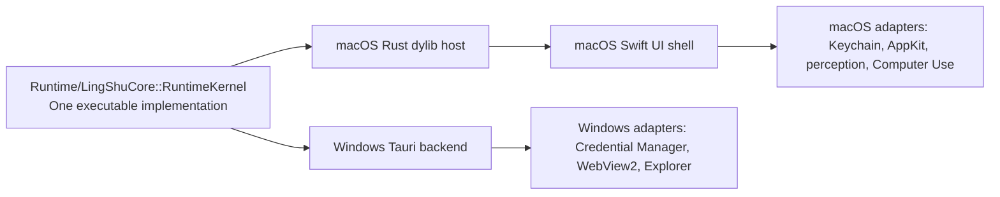

# LingShu for Windows

LingShu's Windows shell is a Tauri 2 desktop application backed by the canonical Rust runtime in [`Runtime/LingShuCore`](../Runtime/LingShuCore). It is intentionally not a fork or a reimplementation of the agent logic. Windows constructs `RuntimeKernel` directly in its Tauri backend; macOS loads a Rust dynamic-library host that constructs the same `RuntimeKernel` type. The versioned contract in [`kernel-contract.json`](../Runtime/LingShuCore/resources/kernel-contract.json) guards that shared implementation's platform boundary.

## Architecture


```mermaid
flowchart LR
    K["Runtime/LingShuCore::RuntimeKernel\nOne executable implementation"] --> H["macOS Rust dylib host"]
    K --> W["Windows Tauri backend"]
    H --> M["macOS Swift UI shell"]
    M --> A["macOS adapters: Keychain, AppKit, perception, Computer Use"]
    W --> B["Windows adapters: Credential Manager, WebView2, Explorer"]
```

GoalSpec generation, the serialized main-task queue, isolated worker/checker sessions, model tool loops, human-action pause/resume, artifacts, persistence, and runtime events live only in `RuntimeKernel`. Swift and Tauri project that canonical state into native UI and provide platform adapters; they do not maintain duplicate agent loops. The frozen ABI covers the platform boundary, and tests verify both shells instantiate the same Rust implementation and produce equal core semantics for the same inputs.

## Current Windows Scope

Implemented in the Windows technical preview:

- forced first-run language and model-channel setup;
- OpenAI Responses, OpenAI-compatible Chat Completions, and Anthropic Messages providers, including built-in presets for OpenAI, Claude, DeepSeek, MiniMax, OpenRouter, Qwen, Doubao, Ollama, LM Studio, and custom endpoints;
- one serialized main-task queue with persistent conversation and task records;
- copy actions for completed visible messages and an edit-and-resend action that restores a user message and its recorded attachments into the composer without auto-sending or changing history;
- a macOS-aligned Memory page backed by the actual shared Runtime Core, with search, filters, pagination, create/edit/delete, optimistic concurrency checks, and explicit per-item reveal for sensitive records;
- full-history GoalSpec generation without a fabricated default fallback;
- persistent model/tool sessions with streaming response and concise reasoning-summary events;
- isolated worker and checker sessions, including parallel child dispatch and parent-result return;
- structured execution events for model calls, plans, tools, delegation, human participation, and final results;
- exact-session pause and resume when a tool requires user input;
- failure and timeout cleanup that leaves no task or event falsely marked as running;
- registered local artifacts and built-in preview for text, Markdown, code, HTML, images, PDF, DOCX, and PPTX;
- built-in embedded-text extraction for PDF, DOCX, and PPTX, with a structured OCR recovery path for scanned PDFs instead of a terminal "no plugin" response;
- bundled DesignKB layouts, palettes, typography, icons, generator, and review rubric, exposed to the model as a real presentation tool;
- a shared-runtime plugin registry with local package installation, enable/disable, readiness probes, declared permissions, model-callable tools, and artifact return;
- a shared external-Skill bridge for Codex, Claude Code, and Open Agent Skills `SKILL.md` directories, including bounded discovery, enable/disable, live source refresh, and progressive on-demand instruction/resource loading;
- explicit buttons to open a file in its Windows default application or reveal it in Explorer;
- API tokens stored in Windows Credential Manager;
- bilingual Chinese and English UI.

Deliberately unavailable in this preview:

- direct Windows UI control;
- live camera, microphone, and desktop perception;
- unattended external application automation.

Opening an artifact in a Windows application is always an explicit user click. The model cannot invoke that adapter.

The local plugin package contract is documented in the
[Plugin SDK](./PLUGIN_SDK.md). Plugins are implemented by the shared Rust
kernel, not duplicated in the Windows frontend. The same document describes
external Skill registration and its security boundary. Vendor-specific hooks,
marketplace installers, and MCP-only bundles are not presented as compatible
Skills unless they include a valid standard `SKILL.md` directory.
Vendor flags that forbid automatic model invocation are enforced. Their
vendor-specific manual slash-command channel is not emulated in this preview.

The x64 setup executable uses a LingShu-branded installer and preserves upgrades from older publisher registry layouts. Application data in `%LOCALAPPDATA%\LingShu` is not removed during a normal upgrade or uninstall unless the user explicitly chooses to delete it.

## Download

- [Windows x64 setup executable](https://github.com/RoyZhao1991/LingShu/releases/download/windows-v0.1.0-preview.27/Nous-Windows-x64-Setup.exe)
- [Windows preview release and MSI alternatives](https://github.com/RoyZhao1991/LingShu/releases/tag/windows-v0.1.0-preview.27)
- [SHA-256 checksums](https://github.com/RoyZhao1991/LingShu/releases/download/windows-v0.1.0-preview.27/SHA256SUMS.txt)
- [Signed and notarized macOS alpha](https://github.com/RoyZhao1991/LingShu/releases/download/v0.1.0-alpha.9/LingShu-0.1.0-12-macOS-universal.dmg)

Windows preview installers are not yet Authenticode-signed. Windows may show a SmartScreen warning; verify the downloaded file against `SHA256SUMS.txt` before installing it.

## Build

Prerequisites: Windows 10/11, Node.js 22, the stable Rust MSVC toolchain, and the Tauri 2 Windows prerequisites.

```powershell
cd WindowsApp
npm ci
npm run tauri -- build
```

The build produces both an MSI and an NSIS setup executable under `WindowsApp/src-tauri/target/release/bundle`. The `Windows` GitHub Actions workflow performs the same build on a real Windows runner and uploads both installers plus SHA-256 checksums.

## 中文说明

Windows 版采用 Tauri 2 外壳，但不是另写一套 Agent：Windows 后端直接构造 `Runtime/LingShuCore::RuntimeKernel`，macOS 则通过 Rust 动态库宿主构造同一个 `RuntimeKernel` 类型。GoalSpec、单主任务队列、隔离 worker/checker、工具循环、人机阻断续跑、产物、持久化和事件时间线都只在这一份 Rust 实现中维护；Swift 与 Tauri 仅负责界面投影和平台适配。版本化 ABI 用来锁定平台边界，而不是用两套实现“对齐行为”。

当前技术预览已经覆盖首次启动引导、主脑配置、主对话、单主任务队列、隔离子线程并行、worker/checker、流式模型响应、推理摘要与工具事件、人机阻断续跑、线程记录、产物登记和应用内预览。已完成的可见消息可复制；用户消息还可连同已记录附件一起回填输入框，编辑后明确重新发送，不会自动发送或修改历史。DesignKB 的版式、配色、字体、图标、生成器和验收规则会随安装包一起提供；插件页使用共享 Rust 内核完成本地插件安装、启停、权限声明、模型工具调用和产物回传，并非单纯的界面列表。Codex、Claude Code 与 Open Agent Skills 的标准 `SKILL.md` 目录也可通过同一页面原样登记，由共享核心按“目录元数据 → 完整说明 → 单项资源”渐进加载；导入不会自动执行脚本，也不会把厂商专有 hooks 或纯 MCP 包伪装成 Skill。Windows 的直接电脑操作、实时视觉和实时听觉暂不开放。点击“用系统应用打开”或“在文件夹中显示”属于明确的用户动作，模型不能自行触发。
