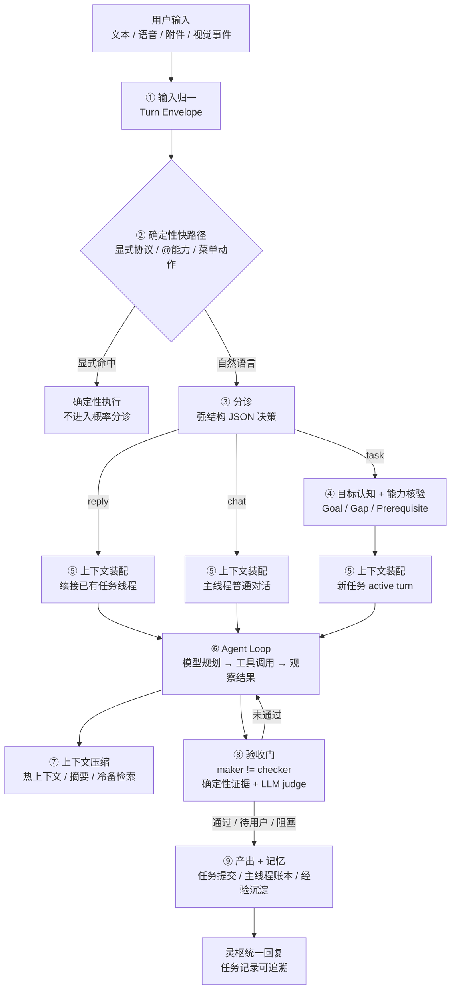
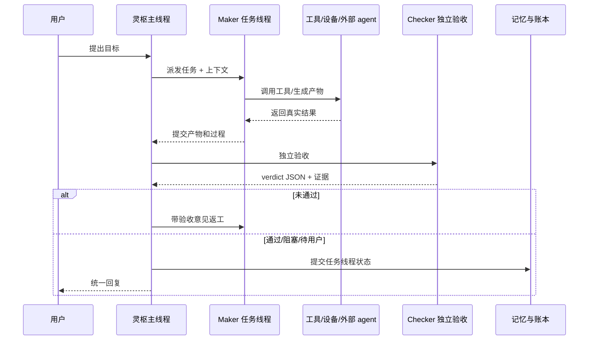

# 灵枢九站核心链路与验收标准

> 目的:把当前已经收口的九站链路固化成后续迭代的共同尺子。以后优化体验、上下文、执行循环或验收门时,先看本文件,再看测试结果。
>
> 原则:灵枢是通用中枢,不是某类任务的定制工具。所有判断优先走结构化合同、trace 和真实证据,不靠关键词误伤。

## 一句话定位

灵枢主线程负责接收目标、恢复上下文、组织能力、守住权限与验收,具体执行由任务线程、工具、外部 agent 或设备完成。用户只需要提出目标;灵枢必须判断这是普通对话、已有任务续接,还是新任务执行。

## 九站总图



## 每站验收口径

| 站点 | 职责 | 必须可观测的证据 | 不允许出现 |
|---|---|---|---|
| ① 输入 | 把文字、语音、附件、视觉事件归一成同一种 turn | 用户气泡、附件 ingestion 状态、输入来源字段 | 附件明明已上传却让用户再找文件 |
| ② 快路径 | 只处理显式协议和 UI 明确动作 | `@能力`、菜单动作、录制重放等确定性入口 | 自然语言关键词抢走大脑判断 |
| ③ 分诊 | 判断 reply/chat/task,并给出置信度和证据 | 完整 JSON 对象、trace、候选任务集 | 解析自由文本、用关键词决定路由 |
| ④ 目标与能力 | 把任务结构化,识别能力缺口和前提 | Goal / Gap / Prerequisite 结构字段 | 把“缺前提”写在正文里再靠文本扫描 |
| ⑤ 上下文装配 | 为当前 turn 选择主线程/任务线程上下文 | `ContextAssemblyPlan` trace、token/缓存测量 | “继续”在没有主体时强行抢某个旧任务 |
| ⑥ Agent Loop | 让模型持续思考、调工具、观察结果 | 每轮 tool call/result、长命令心跳、停止状态 | 工具参数非法还真实执行;卡死无心跳 |
| ⑦ 压缩 | 保留最近上下文和可检索历史 | 压缩前后 token、摘要、冷备检索命中 | 直接丢历史导致续接断裂 |
| ⑧ 验收 | 验目标达成,不是验“模型说完成” | 文件/命令/设备/用户确认/LLM judge 证据 | maker 自己给自己判通过 |
| ⑨ 产出与记忆 | 将终态、产物、经验同步回主线程 | 任务记录、产出物清单、主线程 ledger、经验条目 | 子线程完成但主线程不知道 |

## 结构化合同

所有关键控制流都必须有结构化字段。正文只用于给用户阅读,不能作为控制流依据。

### 分诊结果

```json
{
  "route": "chat | task | reply | none",
  "targetRecordId": null,
  "confidence": "low | medium | high",
  "evidence": ["最近上下文", "显式任务主体", "候选任务状态"],
  "needsClarification": false,
  "clarification": null
}
```

### 任务前提 / 授权 / 缺口

```json
{
  "canProceed": true,
  "missingPrerequisites": [],
  "authorization": {
    "required": false,
    "kind": null,
    "title": null,
    "reason": null,
    "options": []
  },
  "capabilityGaps": [],
  "safeFallback": null
}
```

判定规则:

1. `authorization.required == true` 才允许弹授权窗口。
2. `missingPrerequisites` 非空时渲染“待用户补前提”的结构化卡片。
3. `authorization` 和 `missingPrerequisites` 都为空时,正文里即使出现“授权、token、OAuth”等词也不能弹窗。
4. 如果模型输出不是完整 JSON,进入结构化解析失败流程,不得从文本里猜字段。

## Trace 标准

每条真实 turn 至少要能追到以下链路:

1. `stage=1 input`: 输入来源、附件数量、用户消息 id。
2. `stage=3 triage`: route、confidence、候选任务数量。
3. `stage=5 context`: strategy、targetRecordID、是否加载主线程/任务线程记忆。
4. `stage=6 loop`: model、tool call、tool result、长命令心跳。
5. `stage=8 review`: maker、checker、确定性证据、LLM judge 结论。
6. `stage=9 commit`: 任务终态、产物、ledger 同步、经验沉淀。

## maker != checker

真实任务必须满足 maker != checker:



规则:

1. 纯聊天可以没有 checker,但必须正确收尾为普通回复。
2. 真实产物任务必须登记产出物,并由 checker 独立核验。
3. 代码任务不只看“文件存在”,还要经过质量/风险/可运行性评审。
4. 设备任务必须核验设备状态变化;无法核验时标记 `unverifiable`,不能报完成。

## 回归基线

短程基线用于每次改完快速确认“没把主流程打坏”:

```bash
python3 Scripts/lingshu-product-baseline.py --quick
```

需要让测试结果进入灵枢聊天窗口时:

```bash
python3 Scripts/lingshu-product-baseline.py --quick --report-to-chat
```

推荐覆盖项:

1. 自我介绍后的“继续”要续接最近对话,不抢未完成任务。
2. OAuth、token 等普通知识问答不能弹授权卡。
3. 附件已经上传时,灵枢必须直接使用附件内容。
4. 真实任务要有任务记录、产物清单和终态。
5. 任务 follow-up 必须续接同一任务线程。
6. 停止任务后,新普通问答不能被旧任务状态污染。
7. 主线程 ledger 必须看到最新任务状态。
8. 用户可见气泡不得泄漏 JSON、内部工具名或占位符。

## 长稳压测

长稳压测用于真实世界稳定性,默认跑长时间:

```bash
JARVIS_SOAK_MINUTES=300 JARVIS_SOAK_CYCLES=100000 bash Scripts/jarvis-soak.sh
```

短版回归:

```bash
JARVIS_SOAK_MINUTES=45 JARVIS_SOAK_CYCLES=1 bash Scripts/jarvis-soak.sh
```

压测必须优先覆盖真实场景:

1. 制作 PPT / 预览 / 演示 / 答疑 / 收尾。
2. 本机附件理解。
3. 授权与缺前提。
4. 语音文本入口。
5. 浏览器/预览/设备发现。
6. 队列与一问一答顺序。
7. 打断恢复。
8. 自主模式开关。

## 失败分级

| 级别 | 例子 | 处理 |
|---|---|---|
| P0 | 卡死、队列不动、授权误弹阻塞、用户输入无法继续 | 立即修复,不进入下一站 |
| P1 | 上下文续接错、任务状态没同步、产物未登记 | 修复后跑短程基线 + 对应长跑探针 |
| P2 | 体验慢、文案啰嗦、trace 不够清楚 | 记录到 UX / 诊断待办 |
| P3 | 模型回答质量不佳但链路正确 | 换脑/提示优化,不改框架判断 |

## 后续开发约束

1. 不新增自然语言关键词硬路由。
2. 不让 UI 文本决定控制流。
3. 不把单个任务场景写成专用流程。
4. 不把调试日志直接塞进用户对话。
5. 不允许假完成:文件、命令、设备、用户确认都要有证据。
6. 所有新增能力都要能进入任务执行记录,并能被 trace 回放。
