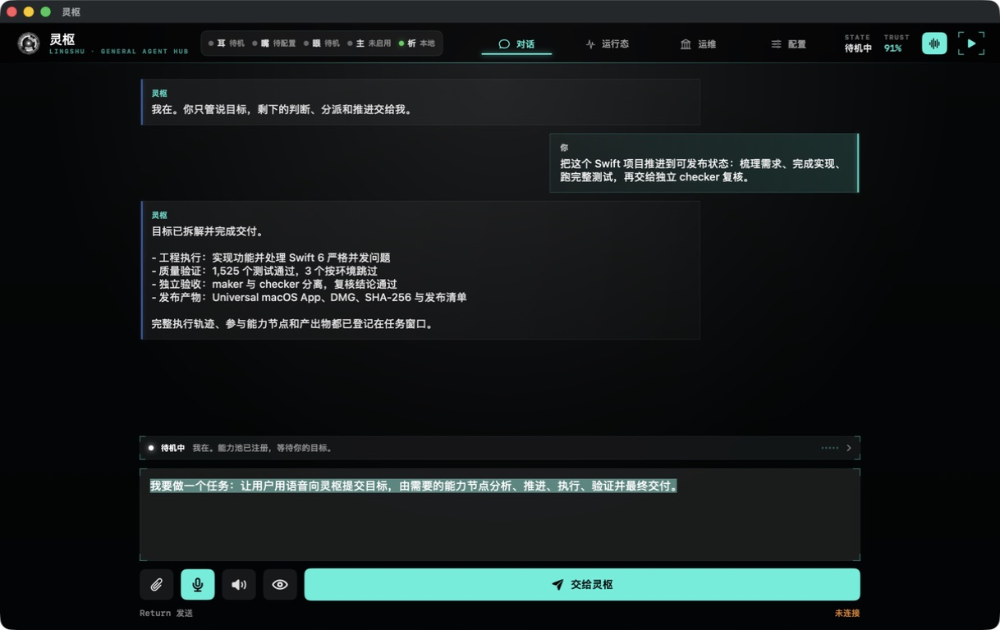
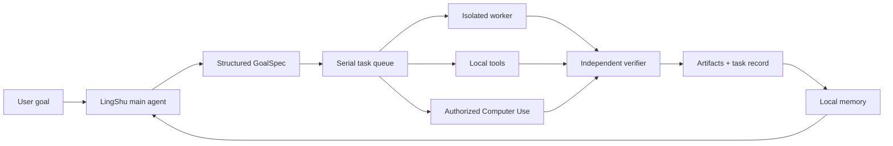

<div align="center">
  
  <h1>LingShu</h1>
  <p><strong>A native macOS AI agent that turns goals into verified deliverables.</strong></p>
  <p><strong>Flagship workflow: complete editable presentations and document reports end to end—not just outlines or chat answers.</strong></p>
  <p>Bring your own model. Keep the orchestration, tools, memory, and computer control on your Mac.</p>

  <p>
    <a href="./README.md">English</a> |
    <a href="./README.zh-CN.md">简体中文</a>
  </p>

  <p>
    
    
    
    
    
    <a href="https://github.com/RoyZhao1991/LingShu/actions/workflows/ci.yml"></a>
  </p>
</div>

<p align="center">
  
</p>
<p align="center"><sub>Real LingShu interface with isolated demo content. No user history, credentials, or private files are included.</sub></p>

> [!IMPORTANT]
> LingShu is an alpha-stage project under active development. It can operate local files and apps after explicit macOS authorization. Review requested permissions and keep backups of important work.

## Why LingShu

Most AI desktop apps stop at conversation. LingShu is an agent runtime designed to continue from intent to execution and verification:

- **Finish the report, not just the outline.** From one brief, LingShu can structure the narrative, create a real editable presentation or document, register and preview the file, iterate on it, and send it to an independent checker.
- **Bring your own brain.** Use OpenAI, Anthropic, DeepSeek, MiniMax M3, or a custom compatible endpoint without coupling LingShu's identity to one model vendor.
- **Delegate real work.** A main agent can plan work, dispatch isolated worker sessions, invoke tools, and hand results to an independent checker.
- **Deliver files, not claims.** Documents, presentations, code, scripts, and reports are written to disk, tracked, previewable, and checked before completion.
- **Use the Mac natively.** LingShu can read accessibility snapshots and operate authorized apps through native macOS APIs. This Computer Use path does not require Codex.
- **Preserve context.** Task records, local artifacts, memories, and distilled child-task summaries remain available across sessions.

## Flagship Workflow: Complete Reports

LingShu does not stop at “here is a slide outline.” A presentation or document request can run as one traceable delivery loop:

1. Understand the brief and source material, then define the expected deliverable and acceptance criteria.
2. Structure the story, content, and layout; create a real `.pptx`, `.docx`, or other requested report format with local tools.
3. Register the file in the task artifact ledger, open it in the built-in preview, and revise the actual output.
4. Hand the result to an independent checker before declaring the task complete.
5. For presentations, optionally build a narration queue, present the deck, and answer questions against its content.

The result is a local file that remains openable, editable, previewable, and available to later tasks—not a filename invented in chat. Output quality still depends on the configured model, source material, and local toolchain, so important reports should be reviewed before external use.

## What It Can Do

| Area | Current capability |
| --- | --- |
| Agent execution | Goal understanding, planning, tool loops, isolated child tasks, interruption, resume, and verification |
| Computer Use | Native accessibility snapshots, indexed UI actions, screen fallback, and post-action verification |
| Local work | Read/write files, run commands, edit code, execute tests, inspect Git changes, and register artifacts |
| Deliverables | Create, register, preview, revise, and verify real PPTX, DOCX, PDF, Markdown, code, scripts, and local media |
| Model gateway | OpenAI Responses / Chat Completions, Anthropic Messages, streaming, and custom compatible endpoints |
| Multimodal input | Try native model vision first; remember unsupported channels and fall back to image parsing |
| Perception | Microphone, system audio, camera, screen, voice output, and pluggable sensory sources |
| Memory | Local knowledge graph, preference recall, task history, and distilled experience |
| Integrations | Local HTTP JSON-RPC control plane and registered external-agent capabilities |

## How It Works



The main conversation remains serialized to protect context. Long-running or delegated work uses isolated sessions, then returns a distilled completion record to the main agent.

## Quick Start

### Requirements

- macOS 14 or later
- Xcode Command Line Tools with Swift 6
- An API token for one supported model provider, or a compatible custom endpoint

### Build From Source

```bash
git clone https://github.com/RoyZhao1991/LingShu.git
cd LingShu
bash Scripts/build-app.sh debug
open "dist/灵枢.app"
```

Run the packaged `.app`, not the bare Swift executable, so macOS can associate the correct icon, signing identity, and privacy permissions with LingShu.

On first launch, LingShu checks whether a working brain channel exists. If not, the setup guide lets you choose a provider and enter its token. Custom providers additionally require an endpoint and model name.

### Supported Brain Presets

| Provider | What you enter | Protocol |
| --- | --- | --- |
| OpenAI | API token | OpenAI compatible |
| Anthropic Claude | API token | Anthropic Messages |
| DeepSeek | API token | OpenAI compatible |
| MiniMax M3 | API token | OpenAI compatible |
| Custom | Endpoint, token if required, model | OpenAI-compatible custom route |

API credentials are local runtime configuration and must never be committed. See [runtime configuration notes](./Resources/RuntimeConfig/README.md).

## Permissions and Safety

LingShu requests macOS permissions only when a capability needs them. Computer control can require Accessibility and Screen Recording; voice and visual perception can require Microphone, Speech Recognition, and Camera access.

- Sensory streams are processed in memory by LingShu and are not archived by default.
- Content sent to a configured remote model or perception provider leaves the Mac and is governed by that provider's retention and privacy terms.
- Secrets are redacted from task traces where supported and runtime credential files are ignored by Git.
- High-risk, irreversible, account, authorization, or external-publication actions require explicit user confirmation.
- Native Computer Use is permission-scoped and verifies the UI again after actions when possible.

See [SECURITY.md](./SECURITY.md) and the [perception audit](./Docs/PERCEPTION_AUDIT.md) for the current boundaries.

## Project Status

LingShu is usable for development and controlled local workflows, but it is not yet a finished consumer product.

| Area | Status |
| --- | --- |
| Native macOS app and agent loop | Active development |
| Multi-provider model setup | Implemented |
| Native Computer Use | Implemented; requires explicit macOS authorization |
| End-to-end presentation, document, and code artifact workflow | Implemented |
| Live perception and voice | Available with environment-dependent fallbacks |
| HAL virtual microphone | Experimental; device appearance is not yet stable |
| Signed and notarized public release | Release pipeline exists; first public release pending |

The repository currently contains more than 100,000 lines of source and test code, 185 Swift test files, and 1,526 tests discovered by SwiftPM. These numbers describe engineering depth, not a guarantee that every environment-dependent test passes on every Mac.

## Development

```bash
swift test
bash Scripts/smoke-e2e.sh
```

For a signed, notarized website build, see [`Scripts/release-website.sh`](./Scripts/release-website.sh). Apple Developer credentials are intentionally supplied at release time and are never stored in the repository.

Architecture references:

- [Architecture overview](./Docs/ARCHITECTURE.md)
- [Canonical architecture field guide (Chinese)](./Docs/架构速查手册.md)
- [Roadmap](./Docs/ROADMAP.md)
- [Changelog](./CHANGELOG.md)

## Contributing

Bug reports, focused pull requests, provider adapters, tests, documentation, and reproducible performance measurements are welcome. Start with [CONTRIBUTING.md](./CONTRIBUTING.md), follow the [Code of Conduct](./CODE_OF_CONDUCT.md), and report vulnerabilities privately as described in [SECURITY.md](./SECURITY.md).

## License

LingShu is licensed under the [Apache License 2.0](./LICENSE). Third-party components retain their own licenses; see [THIRD_PARTY_NOTICES.md](./THIRD_PARTY_NOTICES.md).

Created and maintained by [Roy Zhao](https://github.com/RoyZhao1991).
