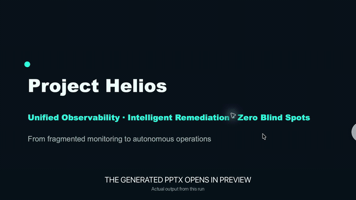
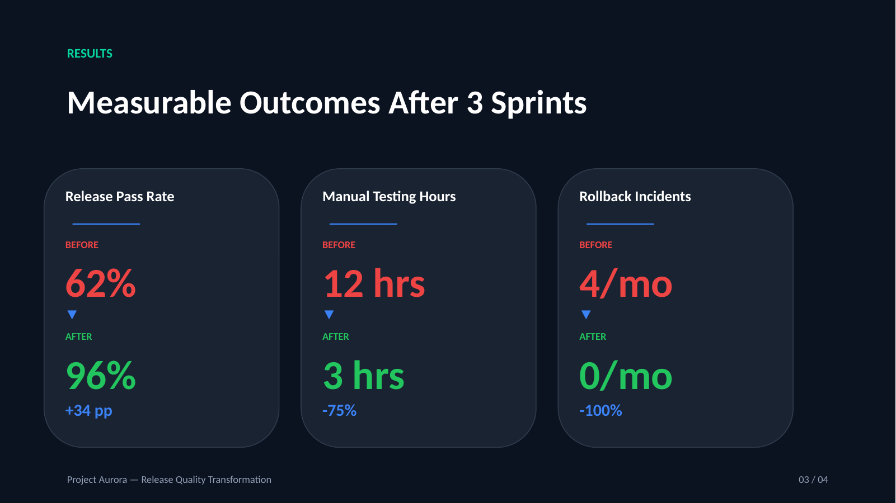
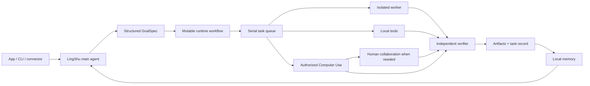

<div align="center">
  
  <h1>LingShu</h1>
  <p><strong>A fully open-source, model-agnostic execution agent in the Codex / Claude Code category.</strong></p>
  <p><strong>Code is one deliverable, not the boundary: ship verified software, presentations, documents, and authorized Mac workflows.</strong></p>
  <p>Use OpenAI, Claude, DeepSeek, MiniMax, or a compatible endpoint. Keep the agent runtime, orchestration, memory, and artifacts on your own computer.</p>

  <p>
    <a href="./README.md">English</a> |
    <a href="./README.zh-CN.md">简体中文</a>
  </p>

  <p>
    
    
    
    
    
    
    <a href="https://github.com/RoyZhao1991/LingShu/actions/workflows/ci.yml"></a>
    <a href="https://github.com/RoyZhao1991/LingShu/actions/workflows/windows.yml"></a>
    <a href="https://github.com/RoyZhao1991/LingShu/releases/tag/v0.1.0-alpha.9"></a>
    <a href="https://github.com/jaywcjlove/awesome-mac#ai-tools"></a>
  </p>

  <p>
    <a href="https://royzhao1991.github.io/LingShu/"><strong>Official website</strong></a>
    ·
    <a href="https://github.com/RoyZhao1991/LingShu/releases/download/v0.1.0-alpha.9/LingShu-0.1.0-12-macOS-universal.dmg"><strong>macOS signed alpha</strong></a>
    ·
    <a href="https://github.com/RoyZhao1991/LingShu/releases/download/windows-v0.1.0-preview.1/LingShu-Windows-x64-Setup.exe"><strong>Windows x64 preview</strong></a>
    · <a href="#real-public-sample"><strong>Inspect a real sample</strong></a>
    · <a href="#quick-start">Quick start</a>
    · <a href="https://github.com/RoyZhao1991/LingShu/discussions">Community</a>
    · <a href="./README.zh-CN.md">中文</a>
  </p>
</div>

<p align="center">
  <a href="./Docs/media/lingshu-end-to-end-demo.mp4"></a>
</p>
<p align="center"><sub><a href="./Docs/media/lingshu-end-to-end-demo.mp4">Watch the full 71-second demo</a>. It uses a real privacy-safe Project Helios run and its actual editable PPTX/DOCX outputs; long waits are visibly accelerated 12x. The final GoalSpec and artifact-ledger inspection is explicitly labeled as a second verified synthetic-data run.</sub></p>

> [!IMPORTANT]
> LingShu is an alpha-stage project under active development. It can operate local files and apps after explicit macOS authorization. Review requested permissions and keep backups of important work.

The Windows technical preview and macOS app execute the **same `Runtime/LingShuCore::RuntimeKernel` implementation**. Windows constructs it directly in Tauri; macOS links it through the packaged Rust runtime library. The UI shells and platform adapters differ, but GoalSpec, queues, worker/checker sessions, tool loops, human-action resume, artifacts, persistence, and events do not. Direct Windows computer control and realtime perception are intentionally unavailable. See [LingShu for Windows](./Docs/WINDOWS.md).

## Where LingShu Fits

Codex and Claude Code set the standard for execution-oriented coding agents. LingShu belongs in that same agent category—not the chat-app category—but makes a different architectural choice: the complete native app and runtime are Apache-2.0 open source, the model backend is replaceable, and code is one deliverable among several.

| Dimension | LingShu | OpenAI Codex | Claude Code |
| --- | --- | --- | --- |
| Primary product focus | General execution: code and office documents on macOS/Windows, plus authorized computer workflows on macOS | Software engineering | Software engineering |
| Publicly open-sourced surface | Native app + agent runtime, Apache-2.0 | Codex CLI, Apache-2.0 | Official repository is all rights reserved |
| Default model layer | User-selected OpenAI, Claude, DeepSeek, MiniMax, or compatible endpoint | OpenAI models | Claude models |
| Default deliverables | Code, PPTX, DOCX, PDF, local media, and authorized Mac actions | Code changes and engineering work | Code changes and engineering work |

This is a positioning comparison, not a benchmark or claim of superiority. Product surfaces change; the current references are the official [Codex repository](https://github.com/openai/codex), [Codex product page](https://openai.com/codex/), [Claude Code repository](https://github.com/anthropics/claude-code), and [Claude Code product page](https://www.anthropic.com/product/claude-code). Model capability and output quality vary by provider.

LingShu's differentiators are architectural:

- **Finish the report, not just the outline.** From one brief, LingShu can structure the narrative, create a real editable presentation or document, register and preview the file, iterate on it, and send it to an independent checker.
- **Bring your own brain.** Use OpenAI, Anthropic, DeepSeek, MiniMax M3, or a custom compatible endpoint without coupling the agent layer to one model vendor.
- **Inspect the complete runtime.** The Swift app, orchestration, tools, task records, artifact ledger, memory, and Computer Use implementation are published under Apache-2.0.
- **Delegate real work.** A main agent can plan work, dispatch isolated worker sessions, invoke tools, and hand results to an independent checker.
- **Deliver files, not claims.** Documents, presentations, code, scripts, and reports are written to disk, tracked, previewable, and checked before completion.
- **Use the Mac natively.** LingShu can read accessibility snapshots and operate authorized apps through native macOS APIs. This Computer Use path does not require Codex.
- **Preserve context.** Task records, local artifacts, memories, and distilled child-task summaries remain available across sessions.

## Flagship Workflow: Complete Reports

LingShu does not stop at “here is a slide outline.” A presentation or document request can run as one traceable delivery loop:

1. Understand the brief and source material, then define the expected deliverable and acceptance criteria.
2. Structure the story, content, and layout; create a real `.pptx`, `.docx`, or other requested report format with local tools.
3. Register the file in the task artifact ledger, open it in the built-in preview, and revise the actual output.
4. Hand the result to an independent checker before declaring the task complete.
5. For presentations, optionally build a narration queue, present the deck, and answer questions against its content.

The result is a local file that remains openable, editable, previewable, and available to later tasks—not a filename invented in chat. Output quality still depends on the configured model, source material, and local toolchain, so important reports should be reviewed before external use.

## Real Public Sample

Project Aurora is a fictional release-quality initiative created as a privacy-safe, reproducible LingShu task. One brief produced an editable four-slide deck and a one-page document; independent rendering then drove several revisions until the final deck passed structural checks and page-by-page visual review.

<p align="center">
  <a href="./Examples/project-aurora/project-aurora-demo.pdf"></a>
</p>

- [View the final PDF](./Examples/project-aurora/project-aurora-demo.pdf)
- [Download the editable PPTX](./Examples/project-aurora/project-aurora-demo.pptx)
- [Download the one-page DOCX](./Examples/project-aurora/project-aurora-demo.docx)
- [Read the exact brief, revision history, and known checker limitation](./Examples/project-aurora/README.md)

The sample is deliberately honest about the run: the first checker missed defects that an external render exposed. LingShu continued the same goal through revision and re-verification rather than presenting the first output as finished.

## What It Can Do

| Area | Current capability |
| --- | --- |
| Agent execution | Goal understanding, mutable runtime workflows, tool loops, isolated child tasks, interruption, resume, and verification |
| Human collaboration | Typed questions, choices, forms, QR/login steps, physical actions, file selection, confirmation, completion probes, and exact-session resume |
| Computer Use | Native accessibility snapshots, indexed UI actions, screen fallback, and post-action verification |
| Local work | Read/write files, run commands, edit code, execute tests, inspect Git changes, and register artifacts |
| Deliverables | Create, register, preview, revise, and verify real PPTX, DOCX, PDF, Markdown, code, scripts, and local media |
| Model gateway | OpenAI Responses / Chat Completions, Anthropic Messages, streaming, and custom compatible endpoints |
| Multimodal input | Try native model vision first; remember unsupported channels and fall back to image parsing |
| Perception | Microphone, system audio, camera, screen, voice output, and pluggable sensory sources |
| Memory | Local knowledge graph, preference recall, task history, and distilled experience |
| Integrations | Bundled `lingshu` CLI, local HTTP JSON-RPC control plane, and registered external-agent capabilities |

## How It Works



The main conversation remains serialized to protect context. Long-running or delegated work uses isolated sessions, then returns a distilled completion record to the main agent. During execution, the model may update only the still-pending portion of the runtime graph; the GoalSpec and acceptance boundary remain fixed. A worker, tool, or checker can pause its exact session for human participation and resume from that checkpoint instead of restarting the goal.

## Quick Start

### Requirements

- macOS 14 or later, or Windows 10/11 x64 for the technical preview
- An API token for one supported model provider, or a compatible custom endpoint

### Install on macOS (Signed and Notarized)

With [Homebrew](https://brew.sh/), the app and `lingshu` CLI are installed together:

```bash
brew install --cask RoyZhao1991/tap/lingshu
```

Or install the Universal DMG manually:

1. Download the DMG and its `.sha256` file from the [v0.1.0-alpha.9 release](https://github.com/RoyZhao1991/LingShu/releases/tag/v0.1.0-alpha.9).
2. In Terminal, verify the download:

   ```bash
   shasum -a 256 -c LingShu-0.1.0-12-macOS-universal.dmg.sha256
   ```

3. Open the DMG, drag `灵枢.app` to Applications, and launch it.
4. Choose a language, connect a model provider, and send a small first request.

The public DMG is Universal (`arm64` + `x86_64`), signed with a Developer ID certificate, notarized by Apple, and carries a stapled notarization ticket. Grant macOS permissions only when a capability you choose requires them.

### Install on Windows (Technical Preview)

1. Download [LingShu-Windows-x64-Setup.exe](https://github.com/RoyZhao1991/LingShu/releases/download/windows-v0.1.0-preview.1/LingShu-Windows-x64-Setup.exe) and [SHA256SUMS.txt](https://github.com/RoyZhao1991/LingShu/releases/download/windows-v0.1.0-preview.1/SHA256SUMS.txt).
2. Verify the installer in PowerShell:

   ```powershell
   Get-FileHash .\LingShu-Windows-x64-Setup.exe -Algorithm SHA256
   Get-Content .\SHA256SUMS.txt
   ```

3. Run the setup executable, choose a language, connect a model provider, and send a small first request.

The Windows preview runs the exact same Rust `RuntimeKernel` as macOS: one serialized main task, isolated concurrent child sessions, visible reasoning summaries and tool events, human-action pause/resume, independent checking, artifact registration, and built-in preview. It intentionally excludes direct Windows computer control and realtime audio/video perception. This first preview is not yet Authenticode-signed, so Windows may show a SmartScreen warning; verify its published SHA-256 before installation. See the complete [Windows capability boundary](./Docs/WINDOWS.md).

### Run a First Traceable Task

After choosing a language and connecting a model, start with a small local deliverable instead of granting broad computer permissions immediately:

> Create a one-page project brief in DOCX, save it locally, preview it, and have an independent checker verify the result.

This exercises the complete path a new user should inspect first: goal understanding, local file creation, artifact registration, built-in preview, and verification. A complete first run has three visible signals: a real `.docx` in LingShu's Workspace, that file opening in the built-in preview, and a task record showing both the artifact and independent checker result.

Whether it succeeds, partly succeeds, or fails, share a privacy-safe [15-minute Alpha first-run report](https://github.com/RoyZhao1991/LingShu/issues/new?template=first_run_report.yml). A successful run only needs the key result fields, not a long log. The same localized report and community links are available in the app under **Help** and **Settings → Self-check**. Use [GitHub Discussions](https://github.com/RoyZhao1991/LingShu/discussions) for setup questions. Never include an API token or private file contents.

### Build From Source

Building from source additionally requires Xcode Command Line Tools with Swift 6.

```bash
git clone https://github.com/RoyZhao1991/LingShu.git
cd LingShu
bash Scripts/build-app.sh debug
open "dist/灵枢.app"
```

Run the packaged `.app`, not the bare Swift executable, so macOS can associate the correct icon, signing identity, and privacy permissions with LingShu.

On first launch, LingShu checks whether a working brain channel exists. If not, the setup guide lets you choose a provider and enter its token. Custom providers additionally require an endpoint and model name.

### CLI and External Connectors

Every app build includes a `lingshu` command-line client. It is a thin entrance to the **same serialized main conversation**: it does not create a second agent runtime or bypass model selection, memory, authorization, task records, or human-interaction gates.

Homebrew exposes the bundled client automatically. For a manual DMG installation, add it to your path with:

```bash
mkdir -p "$HOME/.local/bin"
ln -sf "/Applications/灵枢.app/Contents/MacOS/lingshu" "$HOME/.local/bin/lingshu"
export PATH="$HOME/.local/bin:$PATH"
```

Then use one-request/one-response mode from a terminal, Feishu bot, webhook worker, Shortcut, or another local process:

```bash
lingshu ask "Summarize today's project status"
echo "Create a one-page report" | lingshu ask --json
lingshu status --json
```

If the exact task pauses for login, QR scanning, file selection, confirmation, or another human step, JSON output returns `needs_user_action`, typed materials, and a message ID. Resume that same checkpoint with:

```bash
lingshu answer <message-id> "completed"
```

The client talks only to LingShu's loopback control service by default. See [CLI and connector guide](./Docs/CLI.md) for exit codes, JSON fields, environment variables, and a Feishu/webhook integration pattern.

### Supported Brain Presets

| Provider | What you enter | Protocol |
| --- | --- | --- |
| OpenAI | API token | OpenAI compatible |
| Anthropic Claude | API token | Anthropic Messages |
| DeepSeek | API token | OpenAI compatible |
| MiniMax M3 | API token | OpenAI compatible |
| Custom | Endpoint, token if required, model | OpenAI-compatible custom route |

API credentials are stored in macOS Keychain, remain local runtime configuration, and must never be committed. See [runtime configuration notes](./Resources/RuntimeConfig/README.md).

## Permissions and Safety

LingShu requests macOS permissions only when a capability needs them. Computer control can require Accessibility and Screen Recording; voice and visual perception can require Microphone, Speech Recognition, and Camera access.

If a first-run permission prompt is unclear or a capability still fails after you grant access, see [First-run macOS permission troubleshooting](./Docs/FIRST_RUN_PERMISSION_TROUBLESHOOTING.md).

- Sensory streams are processed in memory by LingShu and are not archived by default.
- Content sent to a configured remote model or perception provider leaves the Mac and is governed by that provider's retention and privacy terms.
- Model credentials are stored in macOS Keychain; secrets are redacted from task traces where supported.
- High-risk, irreversible, account, authorization, or external-publication actions require explicit user confirmation.
- Native Computer Use is permission-scoped and verifies the UI again after actions when possible.

See [SECURITY.md](./SECURITY.md) and the [perception audit](./Docs/PERCEPTION_AUDIT.md) for the current boundaries.

## Project Status

LingShu is usable for development and controlled local workflows, but it is not yet a finished consumer product.

| Area | Status |
| --- | --- |
| Native macOS app and agent loop | Active development |
| Windows desktop shell | Technical preview; shared kernel, built-in preview, no direct computer control |
| Multi-provider model setup | Implemented |
| Native Computer Use | Implemented; requires explicit macOS authorization |
| End-to-end presentation, document, and code artifact workflow | Implemented |
| Live perception and voice | Available with environment-dependent fallbacks |
| HAL virtual microphone | Experimental; device appearance is not yet stable |
| Signed and notarized public release | [v0.1.0-alpha.9 available](https://github.com/RoyZhao1991/LingShu/releases/tag/v0.1.0-alpha.9); embedded Loop Runtime and notarized-DMG clean-user smoke passed |

The repository contains more than 100,000 lines of source and test code, more than 180 Swift test files, and more than 1,500 tests. These numbers describe engineering depth, not a guarantee that every environment-dependent test passes on every Mac.

## Development

```bash
swift test
bash Scripts/smoke-e2e.sh
```

For a signed, notarized website build, see [`Scripts/release-website.sh`](./Scripts/release-website.sh). Official builds are pinned to Developer ID Team `KM7N84AC9Y` and the current signing-certificate fingerprint, which is also recorded in the release manifest. Apple Developer credentials and private keys are never stored in the repository. Changing an official binary invalidates its signature; forks must use their own signing identity.

Official releases also run [`Scripts/smoke-clean-user-dmg.sh`](./Scripts/smoke-clean-user-dmg.sh) against the notarized DMG in a disposable home. The release asset `clean-user-smoke-result.json` records the first-launch, isolation, no-permission, empty-history, signature, and minimal-reply checks without using maintainer credentials.

Architecture references:

- [Shareable bilingual architecture and value map](https://royzhao1991.github.io/LingShu/architecture/)
- [Architecture overview](./Docs/ARCHITECTURE.md)
- [Canonical architecture field guide (Chinese)](./Docs/架构速查手册.md)
- [Roadmap](./Docs/ROADMAP.md)
- [Changelog](./CHANGELOG.md)

## Community

- Ask setup questions and share workflows in [GitHub Discussions](https://github.com/RoyZhao1991/LingShu/discussions).
- Report reproducible defects through the [issue tracker](https://github.com/RoyZhao1991/LingShu/issues).
- Start with a [`good first issue`](https://github.com/RoyZhao1991/LingShu/issues?q=is%3Aissue%20state%3Aopen%20label%3A%22good%20first%20issue%22) if you want to contribute code or documentation.
- Report security issues privately as described in [SECURITY.md](./SECURITY.md), not in a public issue.

## Contributing

Bug reports, focused pull requests, provider adapters, tests, documentation, and reproducible performance measurements are welcome. Start with [CONTRIBUTING.md](./CONTRIBUTING.md), follow the [Code of Conduct](./CODE_OF_CONDUCT.md), and report vulnerabilities privately as described in [SECURITY.md](./SECURITY.md).

## License

LingShu is licensed under the [Apache License 2.0](./LICENSE). Third-party components retain their own licenses; see [THIRD_PARTY_NOTICES.md](./THIRD_PARTY_NOTICES.md).

Created and maintained by [Roy Zhao](https://github.com/RoyZhao1991).
