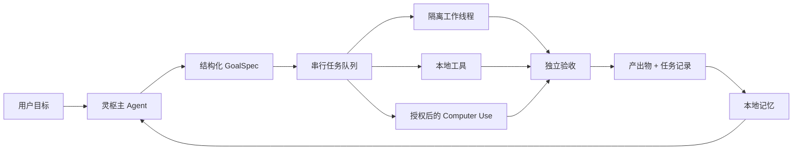

<div align="center">
  
  <h1>灵枢 LingShu</h1>
  <p><strong>把目标推进为经过验收的真实交付物的原生 macOS AI Agent。</strong></p>
  <p>大脑可以更换，编排、工具、记忆与计算机操作留在你的 Mac 上。</p>

  <p>
    <a href="./README.md">English</a> |
    <a href="./README.zh-CN.md">简体中文</a>
  </p>

  <p>
    
    
    
    
    
    <a href="https://github.com/RoyZhao1991/LingShu/actions/workflows/ci.yml"></a>
  </p>
</div>

> [!IMPORTANT]
> 灵枢仍处于 Alpha 阶段并在快速迭代。它会在获得明确的 macOS 授权后操作本地文件与应用。请确认权限范围，并为重要工作保留备份。

## 为什么做灵枢

多数桌面 AI 停留在对话层。灵枢把自己定位为一套原生 macOS Agent 运行时，从意图继续推进到执行和验收：

- **大脑可替换**：支持 OpenAI、Anthropic、DeepSeek、MiniMax M3 与自定义兼容端点，不把灵枢身份锁死在某一家模型上。
- **能够真实派活**：主 Agent 可以规划、调用工具、派发隔离子线程，并交给独立 checker 验收。
- **交付文件而不是口头宣称**：文档、PPT、代码、脚本和报告会真实落盘、登记、预览并在完成前检查。
- **原生操作 Mac**：通过 macOS 辅助功能语义快照读取并操作已授权应用；原生 Computer Use 不依赖 Codex。
- **保留工作上下文**：任务记录、本地产物、记忆和子任务蒸馏摘要可以跨会话继续使用。

## 当前能力

| 领域 | 当前实现 |
| --- | --- |
| Agent 执行 | 目标理解、规划、工具循环、隔离子任务、中断、续跑与验收 |
| Computer Use | 原生 AX 语义快照、元素索引操作、屏幕兜底与动作后验证 |
| 本地工作 | 文件读写、命令运行、代码修改、测试执行、Git 改动检查与产物登记 |
| 交付物 | 生成并预览文档、PPT、报告、代码、脚本与本地媒体 |
| 模型网关 | OpenAI Responses / Chat Completions、Anthropic Messages、流式与自定义端点 |
| 多模态输入 | 默认先尝试模型原生视觉；确认不支持后记忆能力状态并降级图片解析 |
| 感知 | 麦克风、系统声音、摄像头、屏幕、语音输出与可插拔外部感知源 |
| 记忆 | 本地知识图谱、偏好召回、任务历史与经验蒸馏 |
| 集成 | 本地 HTTP JSON-RPC 控制面与外部 Agent 能力注册 |

## 工作方式



主对话保持串行，避免上下文相互污染；长任务和派发任务在隔离会话中运行，完成后把经过蒸馏的状态显式注回主 Agent。

## 快速开始

### 环境要求

- macOS 14 或更高版本
- 带 Swift 6 的 Xcode Command Line Tools
- 一个受支持模型服务的 API Token，或自定义兼容端点

### 从源码构建

```bash
git clone https://github.com/RoyZhao1991/LingShu.git
cd LingShu
bash Scripts/build-app.sh debug
open "dist/灵枢.app"
```

请运行打包后的 `.app`，不要直接运行裸 Swift 二进制。这样 macOS 才能把图标、签名身份和隐私权限稳定关联到灵枢。

首次启动时，灵枢会检查是否存在可用主脑；如果没有，会自动打开配置引导。预设服务商只需填写 Token，自定义服务还需填写端点与模型名。

### 主脑预设

| 服务商 | 需要填写 | 协议 |
| --- | --- | --- |
| OpenAI | API Token | OpenAI 兼容 |
| Anthropic Claude | API Token | Anthropic Messages |
| DeepSeek | API Token | OpenAI 兼容 |
| MiniMax M3 | API Token | OpenAI 兼容 |
| 自定义 | 端点、按需填写 Token、模型名 | OpenAI 兼容自定义通道 |

API 凭据只属于本地运行配置，禁止提交到仓库。详见[运行配置说明](./Resources/RuntimeConfig/README.md)。

## 权限与安全边界

灵枢只在能力实际需要时请求 macOS 权限。计算机操作可能需要“辅助功能”和“屏幕录制”；语音与视觉感知可能需要“麦克风”“语音识别”和“摄像头”。

- 灵枢默认只在内存中处理实时感知流，不主动归档原始音视频。
- 内容一旦发送到用户配置的远程模型或感知服务，就已经离开本机，其留存和隐私规则由对应服务商条款决定。
- 运行配置中的敏感文件已被 Git 忽略；支持的执行轨迹会对凭据做脱敏。
- 高风险、不可逆、账号、授权或对外发布动作需要用户明确确认。
- 原生 Computer Use 受系统权限约束，并在条件允许时执行动作后回读验证。

请阅读 [SECURITY.md](./SECURITY.md) 与[感知能力真实性审计](./Docs/PERCEPTION_AUDIT.md)。

## 项目现状

灵枢已经可以用于开发和受控的本地工作流，但还不是完成态消费产品。

| 模块 | 状态 |
| --- | --- |
| 原生 macOS App 与 Agent 循环 | 持续开发中 |
| 多服务商主脑配置 | 已实现 |
| 原生 Computer Use | 已实现；需用户明确授予 macOS 权限 |
| 文档/代码产物工作流 | 已实现 |
| 实时感知与语音 | 可用；部分链路依赖环境并带降级策略 |
| HAL 虚拟麦克风 | 实验性；设备出现仍不稳定 |
| 官网签名与公证发布 | 发布脚本已具备；首个公开 Release 待发布 |

仓库当前包含超过 10 万行源码与测试代码、185 个 Swift 测试文件，以及 SwiftPM 发现的 1,525 项测试。这些数字用于说明工程深度，并不等于所有依赖外部环境的测试都能在每一台 Mac 上通过。

## 开发与测试

```bash
swift test
bash Scripts/smoke-e2e.sh
```

官网分发的签名、公证与 DMG 构建见 [`Scripts/release-website.sh`](./Scripts/release-website.sh)。Apple Developer 凭据只在发布时注入，不存入仓库。

架构资料：

- [总体架构](./Docs/ARCHITECTURE.md)
- [架构速查手册](./Docs/架构速查手册.md)
- [路线图](./Docs/ROADMAP.md)
- [变更记录](./CHANGELOG.md)

## 参与贡献

欢迎提交可复现的 Bug、聚焦的 Pull Request、模型适配器、测试、文档和性能数据。请先阅读 [CONTRIBUTING.md](./CONTRIBUTING.md) 与[行为准则](./CODE_OF_CONDUCT.md)；安全问题请按 [SECURITY.md](./SECURITY.md) 私下报告。

## 许可证

灵枢以 [Apache License 2.0](./LICENSE) 开源。第三方组件保留各自许可证，详见 [THIRD_PARTY_NOTICES.md](./THIRD_PARTY_NOTICES.md)。

由 [Roy Zhao](https://github.com/RoyZhao1991) 创建并维护。
