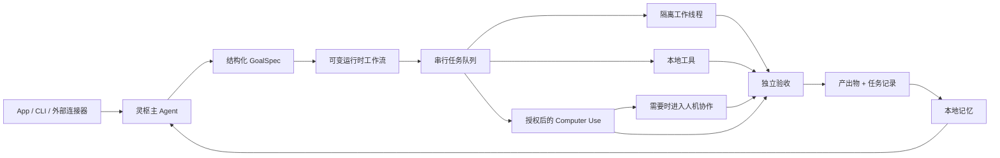

<div align="center">
  
  <h1>灵枢 LingShu</h1>
  <p><strong>一套与 Codex / Claude Code 同类的原生 macOS 执行型 Agent：完整 App 与运行时开源，主脑不绑定厂商。</strong></p>
  <p><strong>代码只是交付物之一，不是能力边界：还可完成 PPT、文档、媒体与授权后的 Mac 工作流。</strong></p>
  <p>支持 OpenAI、Claude、DeepSeek、MiniMax 与兼容端点；Agent 运行时、编排、工具、记忆和产物留在你的 Mac 上。</p>

  <p>
    <a href="./README.md">English</a> |
    <a href="./README.zh-CN.md">简体中文</a>
  </p>

  <p>
    
    
    
    
    
    <a href="https://github.com/RoyZhao1991/LingShu/actions/workflows/ci.yml"></a>
    <a href="https://github.com/RoyZhao1991/LingShu/releases/tag/v0.1.0-alpha.8"></a>
    <a href="https://github.com/jaywcjlove/awesome-mac#ai-tools"></a>
  </p>

  <p>
    <a href="https://royzhao1991.github.io/LingShu/"><strong>官方网站</strong></a>
    ·
    <a href="https://github.com/RoyZhao1991/LingShu/releases/tag/v0.1.0-alpha.8"><strong>下载已签名的 macOS Alpha</strong></a>
    · <a href="#真实公开样例"><strong>检查真实样例</strong></a>
    · <a href="#快速开始">快速开始</a>
    · <a href="https://github.com/RoyZhao1991/LingShu/discussions">社区讨论</a>
    · <a href="./README.md">English</a>
  </p>
</div>

<p align="center">
  <a href="./Docs/media/lingshu-end-to-end-demo.mp4"></a>
</p>
<p align="center"><sub><a href="./Docs/media/lingshu-end-to-end-demo.mp4">观看 71 秒完整演示</a>。演示使用一次真实、隐私安全的 Project Helios 任务及其实际生成的可编辑 PPTX/DOCX；长时间等待明确标注为 12 倍加速。结尾 GoalSpec 与产物账本画面明确标注来自第二次已验证的合成数据任务。</sub></p>

> [!IMPORTANT]
> 灵枢仍处于 Alpha 阶段并在快速迭代。它会在获得明确的 macOS 授权后操作本地文件与应用。请确认权限范围，并为重要工作保留备份。

## 灵枢处在什么赛道

Codex 与 Claude Code 定义了现代执行型编程 Agent 的标杆。灵枢与它们属于同一个 Agent 赛道，而不是聊天工具赛道；不同之处在于：灵枢把完整原生 App 与运行时以 Apache-2.0 开源，主脑可以替换，而且代码只是多种交付物之一。

| 维度 | 灵枢 LingShu | OpenAI Codex | Claude Code |
| --- | --- | --- | --- |
| 主要产品定位 | macOS 通用执行：代码、Office 文档、本地电脑工作流 | 软件工程 | 软件工程 |
| 公开开源范围 | 原生 App + Agent 运行时，Apache-2.0 | Codex CLI，Apache-2.0 | 官方仓库采用 All Rights Reserved |
| 默认模型层 | 用户选择 OpenAI、Claude、DeepSeek、MiniMax 或兼容端点 | OpenAI 模型 | Claude 模型 |
| 默认交付范围 | 代码、PPTX、DOCX、PDF、本地媒体与授权后的 Mac 操作 | 代码修改与工程任务 | 代码修改与工程任务 |

这是一份品类定位与公开形态对比，不是性能榜，也不主张灵枢优于其他产品。产品会持续变化，当前依据为官方 [Codex 仓库](https://github.com/openai/codex)、[Codex 产品页](https://openai.com/codex/)、[Claude Code 仓库](https://github.com/anthropics/claude-code) 与 [Claude Code 产品页](https://www.anthropic.com/product/claude-code)。不同模型的能力与产出质量会有差异。

灵枢的差异主要来自架构选择：

- **交付完整汇报，而不只是提纲**：从一条需求出发，灵枢可以组织叙事与内容，生成真实可编辑的 PPT 或文档，登记并预览文件，迭代修改，再交给独立 checker 验收。
- **大脑可替换**：支持 OpenAI、Anthropic、DeepSeek、MiniMax M3 与自定义兼容端点，不把 Agent 能力层锁死在某一家模型上。
- **完整运行时可审阅**：Swift App、任务编排、工具、执行记录、产物账本、记忆与 Computer Use 实现都以 Apache-2.0 发布。
- **能够真实派活**：主 Agent 可以规划、调用工具、派发隔离子线程，并交给独立 checker 验收。
- **交付文件而不是口头宣称**：文档、PPT、代码、脚本和报告会真实落盘、登记、预览并在完成前检查。
- **原生操作 Mac**：通过 macOS 辅助功能语义快照读取并操作已授权应用；原生 Computer Use 不依赖 Codex。
- **保留工作上下文**：任务记录、本地产物、记忆和子任务蒸馏摘要可以跨会话继续使用。

## 旗舰工作流：完整汇报交付

灵枢不会停在“下面是 PPT 提纲”。一项 PPT 或文档需求可以作为一条可追踪的交付闭环推进：

1. 理解任务与参考资料，明确交付格式和验收标准。
2. 组织叙事、内容与版式，通过本地工具生成真实的 `.pptx`、`.docx` 或用户指定的其他报告格式。
3. 把文件登记到任务产物账本，在应用内预览真实文件，并基于结果继续修改。
4. 完成前把产物交给独立 checker 验收，而不是仅凭生成者自我宣称成功。
5. 对演示文稿还可以建立逐页讲稿队列，实际演示并基于文稿内容回答问题。

最终得到的是可打开、可编辑、可预览、可被后续任务继续使用的本地文件，而不是聊天里虚构的文件名。产出质量仍取决于所选模型、参考资料和本地工具链，重要汇报在对外使用前仍应由用户确认。

## 真实公开样例

Project Aurora 是一个完全虚构的软件发布质量项目，用于公开复现灵枢的完整交付链。一条需求生成了四页可编辑 PPT 和一页 DOCX；独立渲染随后发现初稿缺陷，灵枢围绕同一目标连续修订，最终文件通过结构检查与逐页视觉复核。

<p align="center">
  <a href="./Examples/project-aurora/project-aurora-demo.pdf"></a>
</p>

- [在线查看最终 PDF](./Examples/project-aurora/project-aurora-demo.pdf)
- [下载可编辑 PPTX](./Examples/project-aurora/project-aurora-demo.pptx)
- [下载单页 DOCX](./Examples/project-aurora/project-aurora-demo.docx)
- [查看原始任务、修订过程与 checker 已知限制](./Examples/project-aurora/README.md)

这个样例没有把初稿包装成完美结果：第一轮 checker 漏掉的问题被外部渲染发现后，灵枢继续完成修改和再次验收。这正是“真实产物闭环”与普通聊天答案的区别。

## 当前能力

| 领域 | 当前实现 |
| --- | --- |
| Agent 执行 | 目标理解、可变运行时工作流、工具循环、隔离子任务、中断、续跑与验收 |
| 人机协作 | 结构化提问、选择、表单、扫码/登录、实体操作、文件选择、确认、完成探针与精确会话续跑 |
| Computer Use | 原生 AX 语义快照、元素索引操作、屏幕兜底与动作后验证 |
| 本地工作 | 文件读写、命令运行、代码修改、测试执行、Git 改动检查与产物登记 |
| 交付物 | 生成、登记、预览、修改并验收真实 PPTX、DOCX、PDF、Markdown、代码、脚本与本地媒体 |
| 模型网关 | OpenAI Responses / Chat Completions、Anthropic Messages、流式与自定义端点 |
| 多模态输入 | 默认先尝试模型原生视觉；确认不支持后记忆能力状态并降级图片解析 |
| 感知 | 麦克风、系统声音、摄像头、屏幕、语音输出与可插拔外部感知源 |
| 记忆 | 本地知识图谱、偏好召回、任务历史与经验蒸馏 |
| 集成 | 随 App 交付的 `lingshu` CLI、本地 HTTP JSON-RPC 控制面与外部 Agent 能力注册 |

## 工作方式



主对话保持串行，避免上下文相互污染；长任务和派发任务在隔离会话中运行，完成后把经过蒸馏的状态显式注回主 Agent。执行期间，大脑只能调整运行图中尚未启动的部分，GoalSpec 与验收边界保持不变；worker、工具或 checker 都可以暂停自己的精确会话等待人参与，完成后从该断点续跑，而不是重启整个目标。

## 快速开始

### 环境要求

- macOS 14 或更高版本
- 一个受支持模型服务的 API Token，或自定义兼容端点

### 安装已签名版本（推荐）

使用 [Homebrew](https://brew.sh/) 可同时安装 App 与 `lingshu` CLI：

```bash
brew install --cask RoyZhao1991/tap/lingshu
```

也可以手动安装 Universal DMG：

1. 从 [v0.1.0-alpha.8 Release](https://github.com/RoyZhao1991/LingShu/releases/tag/v0.1.0-alpha.8) 下载 DMG 与对应 `.sha256` 文件。
2. 在终端校验下载文件：

   ```bash
   shasum -a 256 -c LingShu-0.1.0-11-macOS-universal.dmg.sha256
   ```

3. 打开 DMG，将 `灵枢.app` 拖入“应用程序”，然后启动。
4. 选择界面语言、连接模型服务商，并发送一个小型任务完成首次验证。

公开 DMG 同时支持 Apple 芯片和 Intel Mac，使用 Developer ID 签名，已通过 Apple 公证并附加公证票据。只有在所选能力确实需要时再授予对应 macOS 权限。

### 运行第一条可追踪任务

选择语言并接好主脑后，建议先执行一个小型本地产物任务，不要一开始就授予宽泛的电脑操作权限：

> 生成一份单页项目简报 DOCX，保存到本地，打开预览，并交给独立 checker 验收。

这条任务会覆盖新用户最应该先检查的完整链路：目标理解、真实文件生成、产物登记、内置预览和验收。完整首跑会留下三个可见信号：Workspace 中出现真实 `.docx` 文件、该文件能在内置预览中打开、任务记录同时显示产物与独立 checker 结果。

无论成功、部分成功还是失败，都欢迎提交一份不含隐私数据的 [15 分钟 Alpha 首跑报告（中文）](https://github.com/RoyZhao1991/LingShu/issues/new?template=first_run_report_zh.yml)。成功首跑只需选择关键结果，不必撰写长日志。应用内的 **帮助** 菜单和 **设置 → 自检** 页面也提供了跟随当前语言的报告与社区入口。安装问题请到 [GitHub Discussions](https://github.com/RoyZhao1991/LingShu/discussions) 交流。不要提交 API Token 或私人文件内容。

### 从源码构建

从源码构建还需要带 Swift 6 的 Xcode Command Line Tools。

```bash
git clone https://github.com/RoyZhao1991/LingShu.git
cd LingShu
bash Scripts/build-app.sh debug
open "dist/灵枢.app"
```

请运行打包后的 `.app`，不要直接运行裸 Swift 二进制。这样 macOS 才能把图标、签名身份和隐私权限稳定关联到灵枢。

首次启动时，灵枢会检查是否存在可用主脑；如果没有，会自动打开配置引导。预设服务商只需填写 Token，自定义服务还需填写端点与模型名。

### CLI 与外部软件接入

每个 App 构建都包含 `lingshu` 命令行客户端。它只是**同一个串行主会话**的外部入口，不会另起一套 Agent，也不会绕过模型选择、记忆、授权、任务记录或人机交互闸门。

Homebrew 会自动暴露内置 CLI；手动安装 DMG 时，可用下面的方式把它加入命令路径：

```bash
mkdir -p "$HOME/.local/bin"
ln -sf "/Applications/灵枢.app/Contents/MacOS/lingshu" "$HOME/.local/bin/lingshu"
export PATH="$HOME/.local/bin:$PATH"
```

终端、飞书机器人、Webhook 服务、快捷指令或其他本地程序都可以按一问一答方式调用：

```bash
lingshu ask "总结今天的项目状态"
echo "生成一页项目报告" | lingshu ask --json
lingshu status --json
```

当原任务需要登录、扫码、选文件、确认或其他人工步骤时，JSON 会返回 `needs_user_action`、可展示材料和消息 ID。外部软件完成交互后，可精确续接原断点：

```bash
lingshu answer <message-id> "已完成"
```

客户端默认只访问灵枢的本机回环控制服务。退出码、JSON 字段、环境变量和飞书/Webhook 对接范式见 [CLI 与连接器说明](./Docs/CLI.md)。

### 主脑预设

| 服务商 | 需要填写 | 协议 |
| --- | --- | --- |
| OpenAI | API Token | OpenAI 兼容 |
| Anthropic Claude | API Token | Anthropic Messages |
| DeepSeek | API Token | OpenAI 兼容 |
| MiniMax M3 | API Token | OpenAI 兼容 |
| 自定义 | 端点、按需填写 Token、模型名 | OpenAI 兼容自定义通道 |

API 凭据保存在 macOS 钥匙串中，只属于本地运行配置，禁止提交到仓库。详见[运行配置说明](./Resources/RuntimeConfig/README.md)。

## 权限与安全边界

灵枢只在能力实际需要时请求 macOS 权限。计算机操作可能需要“辅助功能”和“屏幕录制”；语音与视觉感知可能需要“麦克风”“语音识别”和“摄像头”。

如果首次权限提示不清楚，或在授予权限后能力仍然失败，请查看 [首次运行 macOS 权限排障](./Docs/FIRST_RUN_PERMISSION_TROUBLESHOOTING.md)。

- 灵枢默认只在内存中处理实时感知流，不主动归档原始音视频。
- 内容一旦发送到用户配置的远程模型或感知服务，就已经离开本机，其留存和隐私规则由对应服务商条款决定。
- 模型凭据保存在 macOS 钥匙串中；支持的执行轨迹会对凭据做脱敏。
- 高风险、不可逆、账号、授权或对外发布动作需要用户明确确认。
- 原生 Computer Use 受系统权限约束，并在条件允许时执行动作后回读验证。

请阅读 [SECURITY.md](./SECURITY.md) 与[感知能力真实性审计](./Docs/PERCEPTION_AUDIT.md)。

## 项目现状

灵枢已经可以用于开发和受控的本地工作流，但还不是完成态消费产品。

| 模块 | 状态 |
| --- | --- |
| 原生 macOS App 与 Agent 循环 | 持续开发中 |
| 多服务商主脑配置 | 已实现 |
| 原生 Computer Use | 已实现；需用户明确授予 macOS 权限 |
| PPT、文档与代码的端到端产物工作流 | 已实现 |
| 实时感知与语音 | 可用；部分链路依赖环境并带降级策略 |
| HAL 虚拟麦克风 | 实验性；设备出现仍不稳定 |
| 官网签名与公证发布 | [v0.1.0-alpha.8 已发布](https://github.com/RoyZhao1991/LingShu/releases/tag/v0.1.0-alpha.8)；公证 DMG 全新用户验证通过 |

仓库包含超过 10 万行源码与测试代码、超过 180 个 Swift 测试文件以及超过 1,500 项测试。这些数字用于说明工程深度，并不等于所有依赖外部环境的测试都能在每一台 Mac 上通过。

## 开发与测试

```bash
swift test
bash Scripts/smoke-e2e.sh
```

官网分发的签名、公证与 DMG 构建见 [`Scripts/release-website.sh`](./Scripts/release-website.sh)。官方构建锁定 Developer ID Team `KM7N84AC9Y` 与当前签名证书指纹，并把指纹写入发布清单；Apple Developer 凭据与私钥不存入仓库。官方二进制一旦被修改，原签名会立即失效；派生版本必须使用自己的签名身份。

官方发布还会使用 [`Scripts/smoke-clean-user-dmg.sh`](./Scripts/smoke-clean-user-dmg.sh) 在一次性用户目录中验证公证 DMG。Release 资产 `clean-user-smoke-result.json` 会记录首次启动、隔离、无权限、空历史、签名和最小直答检查，全程不读取维护者凭据。

架构资料：

- [可单独分享的中英文架构与价值图](https://royzhao1991.github.io/LingShu/architecture/)
- [总体架构](./Docs/ARCHITECTURE.md)
- [架构速查手册](./Docs/架构速查手册.md)
- [路线图](./Docs/ROADMAP.md)
- [变更记录](./CHANGELOG.md)

## 社区

- 在 [GitHub Discussions](https://github.com/RoyZhao1991/LingShu/discussions) 提问安装问题或分享工作流。
- 通过 [Issue 列表](https://github.com/RoyZhao1991/LingShu/issues) 报告可复现问题。
- 想参与代码或文档贡献，可以从 [`good first issue`](https://github.com/RoyZhao1991/LingShu/issues?q=is%3Aissue%20state%3Aopen%20label%3A%22good%20first%20issue%22) 开始。
- 安全问题请按 [SECURITY.md](./SECURITY.md) 私密报告，不要创建公开 Issue。

## 参与贡献

欢迎提交可复现的 Bug、聚焦的 Pull Request、模型适配器、测试、文档和性能数据。请先阅读 [CONTRIBUTING.md](./CONTRIBUTING.md) 与[行为准则](./CODE_OF_CONDUCT.md)；安全问题请按 [SECURITY.md](./SECURITY.md) 私下报告。

## 许可证

灵枢以 [Apache License 2.0](./LICENSE) 开源。第三方组件保留各自许可证，详见 [THIRD_PARTY_NOTICES.md](./THIRD_PARTY_NOTICES.md)。

由 [Roy Zhao](https://github.com/RoyZhao1991) 创建并维护。
